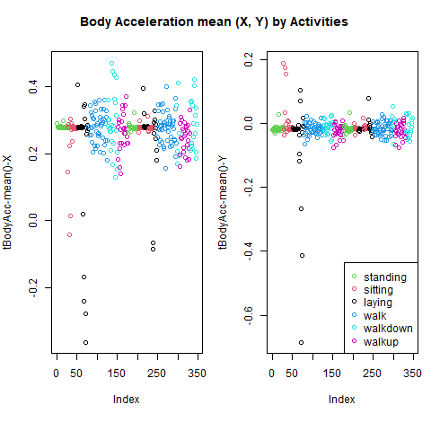
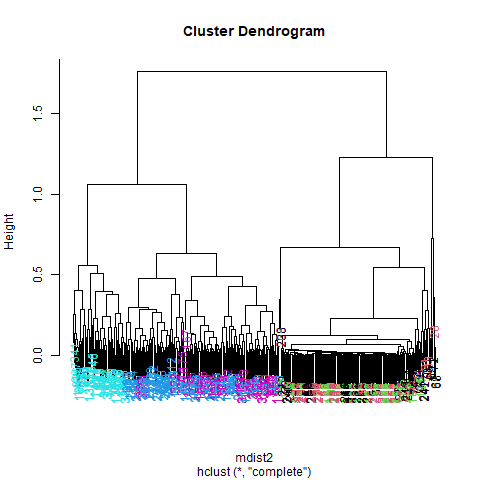
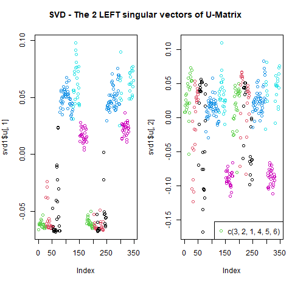
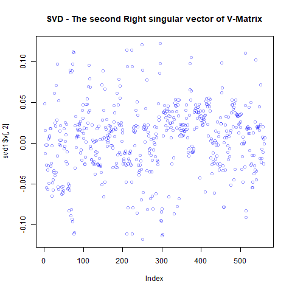
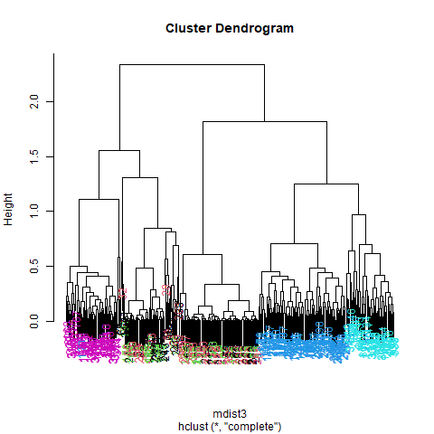
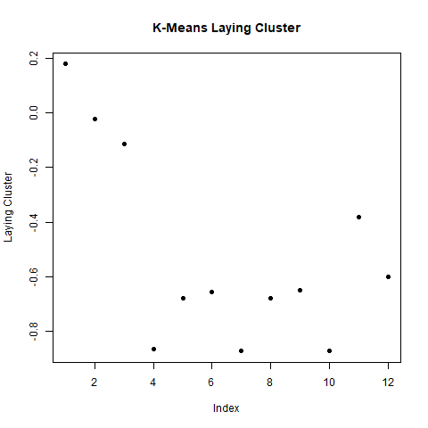
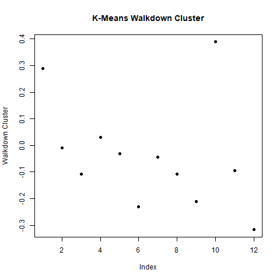

```{r setup, include=FALSE}
knitr::opts_chunk$set("clustering_analysis.R", echo = TRUE, cache=FALSE, eval = TRUE, error = TRUE)
```

# 1. Intro \index{Intro}

The goal is to conduct exploratory data analysis on the 
Human Activity Recognition Using Smartphones Data Set from the UCI Machine Learning Repository, http://archive.ics.uci.edu/ml/datasets/Human+Activity+Recognition+Using+Smartphones.

The study creating this database involved 30 volunteers performing activities of daily living (ADL) while carrying a waist-mounted smartphone with embedded inertial sensors. ... Each person performed six activities ... wearing a smartphone (Samsung Galaxy S II) on the waist. ... The experiments have been video-recorded to label the data manually.  The obtained dataset has been randomly partitioned into two sets, where 70% of the volunteers was selected for generating the training data and 30% the test data.

The "getting_cleaning_data.R" file aggregates both the Train and test data sets in a single Data frame. Than creates a tidy dataset, just with the mean ans standard deviation columns.

The "clustering_analysis.R" analyses and plots the data, applying Hierarchical and K-Means clustering methods.


# 2. Data \index{Data}

Let's understand tha Data: what kind of data we have?

There are 10299 measurements/observations (train and test data set together) and 564 features/columns in the data set. In addition to the 561 features of the measurements, there are added 3 extra columns.

```{r echo=FALSE}
load("env.RData")
names(dfr[1:6,562:564])
```

Let's look at the dataframe

```{r table_data, echo=FALSE}
load("env.RData")
knitr::kable(head(dfr[,1:6]), caption="The Data (the first 6 columns)")
```

Summary of the Data

```{r echo=FALSE}
load("env.RData")
summary(dfr[,1:6])
```

Measurements by Subject

```{r table_subjects, echo=FALSE}
load("env.RData")
#knitr::kable(head(table(dfr$Subject)), caption="Measurements by Subject (the first 6 Subjects)")
table(dfr$Subject)
```

Measurements by Activity

```{r table_activity, echo=FALSE}
load("env.RData")
#knitr::kable(table(dfr$Activity), caption="Measurements by Activity")
table(dfr$Activity)
```

# 3. CodeBook, Variables

```{r table_datavar, echo=FALSE}
load("env.RData")
knitr::kable(str(dfr), caption="Variables")
```

# 4. Exploratory data analysis \index{Exploratory data analysis}

Let's look at only the first subject (numbered 1) which has a number of 347 measurements as seen before. See the measurement of the first 6 subjects out of 30:

```{r table_subject1, echo=FALSE, fig.cap="Measurements of the first 6 subjects"}
load("env.RData")
table(dfr$Subject)[1:6]
```

Let's do some comparisons of activities now by looking at plots
of mean body acceleration in the X and Y directions for the first subject.

```{r BodyAccelerationMeanXY_by_Activities, echo=FALSE, fig.cap="Body Acceleration Mean (X,Y) by Activities", out.width = '100%'}
load("env.RData")

```

We see (Figure 1) that the active activities related to walking (shown in the two blues and magenta) show more variability than the passive activities (shown in black, red, and green), particularly in the X dimension.

## 4.1 Hierarchical clustering \index{Hierarchical clustering}

Let's try hierarchical clustering to see if we can distinguish the activities more.

```{r Hierarchical_Clustering, echo=FALSE, fig.cap="Hierarchical Clustering, active and passive activity colors", out.width = '100%'}
load("env.RData")
knitr::include_graphics("./images/Rplot2_Clustering_activity_colors.png")
```

There's no clear grouping of colors (Figure 2), except that active colors (blues and magenta) are near each other as are the passive (black, red, and green) maximum acceleration.

Let's focus then on the 3 dimensions of maximum acceleration.

```{r Hierarchical_Clustering_better, echo=FALSE, fig.cap="Hierarchical Clustering, 2 Clusters for active and passive activities", out.width = '100%'}
load("env.RData")

```

Now we see clearly that the data splits into 2 clusters (Figure 3), active and passive activities. Moreover, the light blue (walking down) is clearly distinct from the other walking activities. The dark blue (walking level) also seems to be somewhat clustered. The passive activities, however, seem all jumbled together with no clear pattern visible.

## 4.2 SVD Clustering - Singular Value Decomposition \index{SVD Clustering - Singular Value Decomposition}

Let's try some SVD now.

### 4.2.1 Left Singular Vectors, U-Matrix of SVD \index{Left Singular Vectors, U-Matrix of SVD}

```{r SVD_2LeftSingularVect_U-Matrix, echo=FALSE, fig.cap="SVD - The 2 LEFT singular vectors of U-Matrix", out.width = '100%'}
load("env.RData")

```

Here (Figure 4) we're looking at the 2 left singular vectors of SVD (the first 2 columns of the U-Matrix of SVD). Each entry of the columns belongs to a particular row with one of the 6 activities assigned to it. We see the activities distinguished by color. Moving from left to right, the first section of rows are green (standing), the second red (sitting), the third black (laying), etc.  The first column of u shows separation of the nonmoving (black, red, and green) from the walking activities. The second column is harder to interpret. However, the magenta cluster, which represents walking up, seems separate from the others.

We'll try to figure out why that is. To do that we'll have to find which of the 500+ measurements contributes to the variation of that component. We'll look at the RIGHT singular vectors the columns of V-Matrix), and in particular, the second one since the separation of the magenta cluster stood out in the second column of V-Matrix.

### 4.2.2 Right Singular Vectors, V-Matrix of SVD \index{Right Singular Vectors, V-Matrix of SVD}

```{r SVD_2ndRightSingularVect_V-Matrix, echo=FALSE, fig.cap="SVD - The second Right singular vector of V-Matrix", out.width = '100%'}
load("env.RData")

```

Here's a plot (Figure 5) of the second column of the V-Matrix. We used transparency in our plotting but nothing clearly stands out here. Let's use clustering to find the feature (out of the 500+) which contributes the most to the variation of this second column of the V-Matrix.

```{r Hierarchical_Clustering_Max, echo=FALSE, fig.cap="Hierarchical Clustering, Feature Maximal Variationof the second column of V-Matrix", out.width = '100%'}
load("env.RData")

```

Now (Figure 6) we see some real separation. Magenta (walking up) is on the far left, and the two other walking activities, the two blues, are on the far right, but in separate clusters from one another. The nonmoving activities still are jumbled together.

Let's see what measurement is associated with this maximum contributor.

```{r echo=FALSE}
load("env.RData")
names(sub1[maxCon])
```

So the mean body acceleration in the frequency domain in the Z direction is the main contributor to this clustering phenomenon we're seeing.

## 4.3 K-Means Clustering \index{K-Means Clustering}

Let's move on to k-means clustering to see if this technique can distinguish between the activities.

Measurements by cluster and activity

```{r table_k-means_oneRandom, echo=FALSE}
load("env.RData")
table(kClust$cluster, sub1$Activity[,1])
```
The exact output will depend on the state of the random number generator. The walking activities seem to cluster individually by themselves. This was K-Means with one random start.
Now we try K-Means with more random starts and try to return the best one.

```{r table_k-means_moreRandom, echo=FALSE}
load("env.RData")
table(kClust2$cluster, sub1$Activity[,1])
```

We see that even with 100 random starts, the passive activities tend to cluster together. One of the clusters contains only laying, but in another cluster, standing and sitting group together.

The centers are a 6 by 561 array. Sometimes it's a good idea to look at the features (columns) of these centers to see if any dominate.

```{r K-Means_laying, echo=FALSE, fig.cap="K-Means Laying Cluster", out.width = '100%'}
load("env.RData")

```

We see (Figure 7) the first 3 columns dominate this cluster center. Their names are:

```{r k-means_3columns, echo=FALSE}
load("env.RData")
names(sub1[,1:3])
```

So the 3 directions of mean body acceleration seem to have the biggest effect on laying.

See the columns which dominate walkdown.

```{r K-Means_walkdown, echo=FALSE, fig.cap="K-Means Walkdown Cluster", out.width = '100%'}
load("env.RData")

```

We see (Figure 8) an interesting pattern here. From left to right, looking at the 12 acceleration measurements in groups of 3, the points decrease in value. The X direction dominates, followed by Y then Z. This might tell us something more about the walking down activity.

# 5. Conclusion

We saw here that the sensor measurements were pretty good at discriminating between the 3 walking activities, but the passive activities were harder to distinguish from one another. These might require more analysis or an entirely different set of sensory measurements.

# 6. Reference

See Johns Hopkins University, Data Science Specialization, Course Exploratory Data Analysis, swirl() exercises on Clustering.
